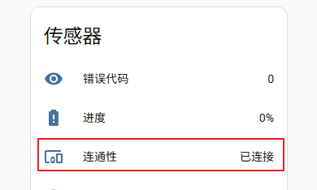
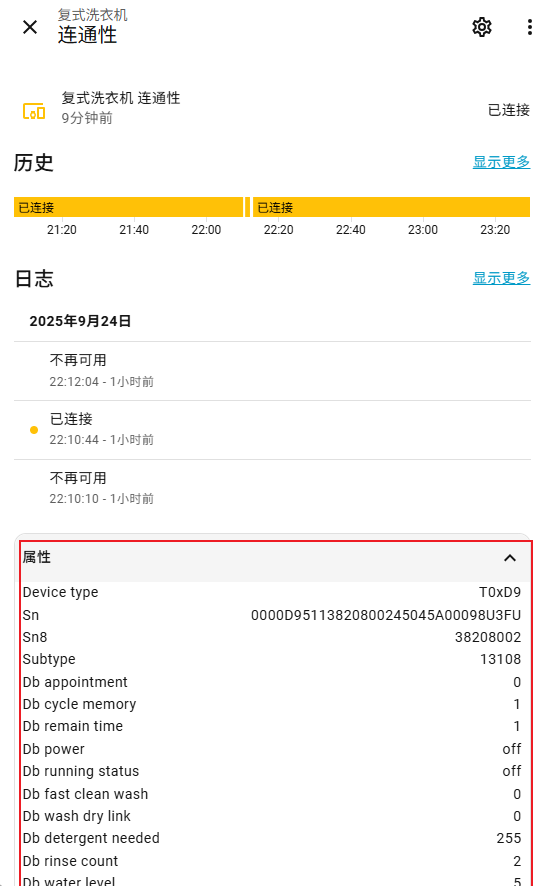

# Midea Auto Cloud
 
 

通过网络获取你美居家庭中的设备，并且通过美的云端进行控制。

- 自动查找和发现设备
- 自动下载设备的协议文件
- 将设备状态更新为设备可见的属性

## 版本说明

- 所有设备默认可生成一个名为Status的二进制传感器，其属性中列出了设备可访问的所有属性，当然有些值不可设置
- Status实体前几项列出了该设备的分类信息，供参考

## 目前支持的设备类型

- T0xAC 空调
- T0xB2 电蒸箱
- T0xB3 消毒碗柜
- T0xB8 智能扫地机器人
- T0xCA 对开门冰箱
- T0xCE 新风机
- T0xCF 中央空调暖家
- T0xD9 复式洗衣机
- T0xDB 滚筒洗衣机
- T0xDC 干衣机
- T0xE1 洗碗机
- T0xE2 电热水器
- T0xE3 恒温式燃气热水器
- T0xEA 电饭锅
- T0xED 软水机
- T0xFA 电风扇
- T0xFD 加湿器

欢迎合作开发添加更多设备支持。

合作开发方法：添加本插件后，找到未能正确识别的设备，点击对应设备`传感器`分类下的`连通性`：

展开下面的`属性`卡片，把里面这些字段复制给我或随issue提交，等待适配就可以了。

## 实体映射

映射文件位于`device_mapping`下, 每个大的品类一个映射文件，目前支持映射的实体类型如下:
- sensor
- binary_sensor
- switch
- select
- climate
- fan
- water_heater

示例配置`22012227`演示了如何将设备属性映射成以上各种HomeAssistant中的实体。

## 致谢

感谢[midea-meiju-codec](https://github.com/MattedBroadSky/midea-meiju-codec)项目提供的先验知识。